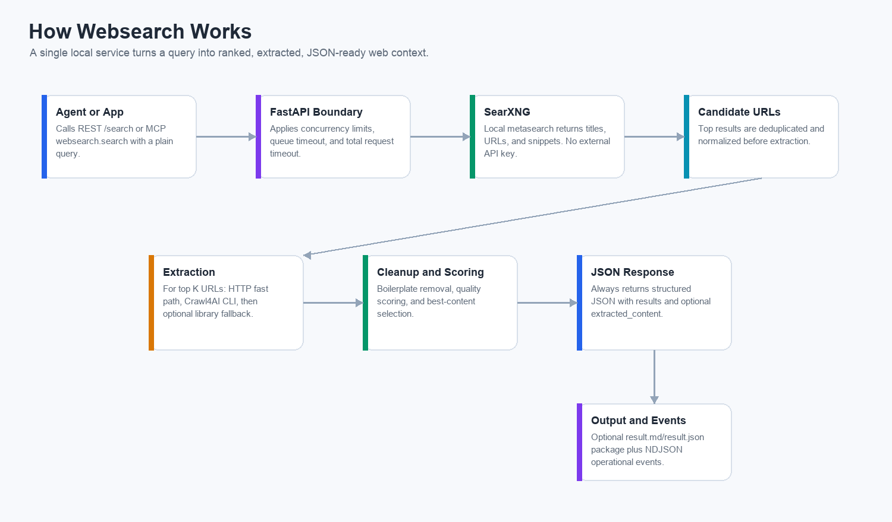
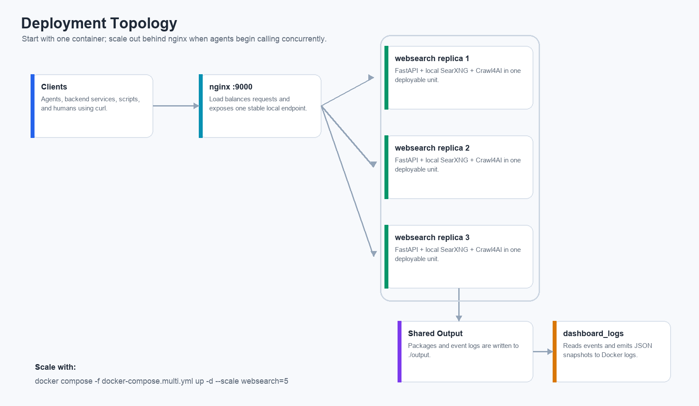
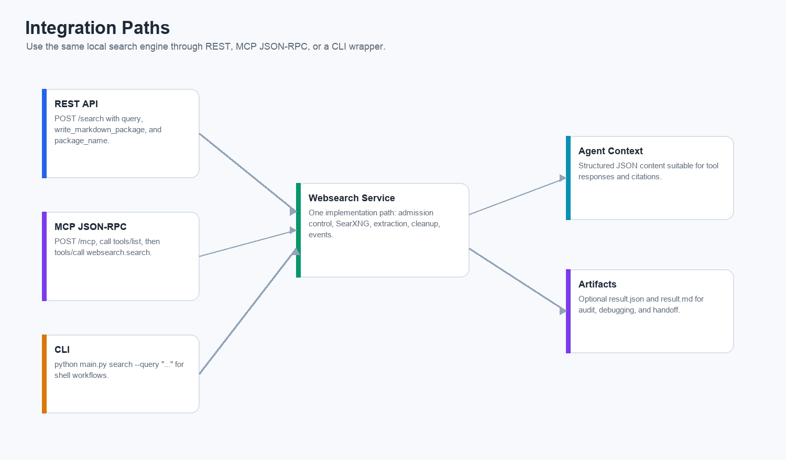
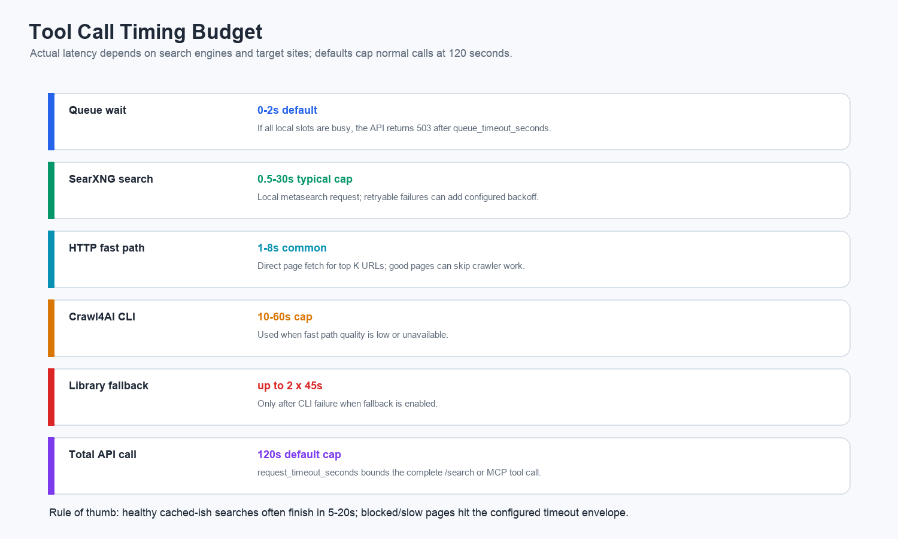

# Websearch

Self-hosted web search and extraction for agents, backend services, and local research workflows.

Websearch packages a local SearXNG metasearch instance, Crawl4AI extraction, a FastAPI JSON API, and an MCP-compatible JSON-RPC endpoint into one Dockerized service. It is designed to give tool-using agents fresh web context without wiring every project to paid search APIs, browser APIs, or vendor-specific credentials.

## The Actual Point

No API keys required. Download it, run Docker Compose, and start calling `localhost:9000`.

That is the real purpose of this project: a practical web search tool you can give to agents without creating accounts, rotating third-party keys, or teaching every app a different search provider contract. It is not magic. Public search engines and target websites can still rate-limit, block, or return messy pages. But the service is local, inspectable, configurable, and ready to sit behind agentic tool calls.

As every senior developer eventually learns: the best API key is the one you did not have to put in a secret manager at 2 a.m.

## What You Get

- `POST /search`: JSON-first search endpoint for applications and scripts.
- `POST /mcp`: MCP-style JSON-RPC endpoint with tool discovery and `websearch.search`.
- Local SearXNG process for metasearch.
- Crawl4AI extraction with HTTP fast path, CLI crawler, and optional library fallback.
- Optional `result.json` and `result.md` packages for audit and handoff.
- NDJSON operational events and Docker-log dashboard snapshots.
- Single-container or nginx load-balanced multi-container deployment.
- Backpressure controls for high-volume agent calls.

## How It Works



A query enters through REST or MCP. The API applies admission control, asks local SearXNG for candidate results, enriches the top URLs through extraction, cleans and scores content, then returns structured JSON. Package files and operational events are optional side effects, not required client dependencies.

## Deployment Topology



For a single-user workflow, run one container. For agentic or deep-research bursts, scale `websearch` replicas behind nginx. Each replica carries its own FastAPI server, local SearXNG, and Crawl4AI runtime.

## Integration Paths



Use the simplest interface for your caller:

- REST when you own the backend code.
- MCP JSON-RPC when an agent UI or tool runtime wants discovery and structured tool calls.
- CLI when a shell script or human wants quick local search output.

## Expected Tool Call Timing



Default timing knobs:

| Stage | Default budget | Notes |
| --- | ---: | --- |
| Queue wait | `2s` | If all request slots are busy, `/search` returns `503 search_capacity_exhausted`. |
| SearXNG request | `30s` per attempt | Retryable failures use `search.searxng_max_retries` and backoff. |
| HTTP fast path | `45s` cap | Direct page fetch for each enriched URL. Good pages often finish much faster. |
| Crawl4AI CLI | `60s` cap | `extract_timeout_seconds + 15`; used when HTTP quality is too low. |
| Crawl4AI library fallback | `2 x 45s` by default | Only used after CLI failure when fallback is enabled. |
| Whole API/tool call | `120s` | `server.request_timeout_seconds` caps `/search` and MCP tool calls. |

Healthy searches often complete in `5-20s`. Slow or blocked sites can hit the configured timeout envelope. For agent swarms, tune concurrency before raising timeouts.

Timeouts are not pessimism; they are optimism with an exit strategy.

## Quick Start

```bash
cd /Users/ryan_chua/Desktop/websearch
cp .env.example .env
echo "SEARXNG_SECRET_KEY=$(openssl rand -hex 32)" >> .env
# fallback if openssl is unavailable:
# python -c "import secrets; print(f'SEARXNG_SECRET_KEY={secrets.token_hex(32)}')" >> .env
docker compose up -d --build
```

`SEARXNG_SECRET_KEY` is still worth keeping random even for local runs (the port is not secret; this key is for app-level signing/security).

Check it:

```bash
curl -sS http://localhost:9000/health
```

Search:

```bash
curl -sS -X POST http://localhost:9000/search \
  -H 'Content-Type: application/json' \
  -d '{
    "query": "latest autonomous shipping regulations",
    "write_markdown_package": true
  }'
```

Disable file output for pure tool-call responses:

```bash
curl -sS -X POST http://localhost:9000/search \
  -H 'Content-Type: application/json' \
  -d '{
    "query": "latest autonomous shipping regulations",
    "write_markdown_package": false
  }'
```

## MCP Usage

Tool discovery:

```bash
curl -sS -X POST http://localhost:9000/mcp \
  -H 'Content-Type: application/json' \
  -d '{"jsonrpc":"2.0","id":1,"method":"tools/list","params":{}}'
```

Tool call:

```bash
curl -sS -X POST http://localhost:9000/mcp \
  -H 'Content-Type: application/json' \
  -d '{
    "jsonrpc":"2.0",
    "id":2,
    "method":"tools/call",
    "params":{
      "name":"websearch.search",
      "arguments":{
        "query":"latest autonomous shipping regulations",
        "write_markdown_package": false
      }
    }
  }'
```

## CLI Usage

The CLI is a thin wrapper around the local API:

```bash
python main.py search \
  --query "latest autonomous shipping regulations" \
  --write-markdown-package
```

Dashboard snapshots:

```bash
python main.py dashboard-logs \
  --output-dir /app/output \
  --interval-seconds 10 \
  --window-seconds 10800 \
  --limit 10 \
  --format table
```

## Load-Balanced Mode

Start or recreate with three `websearch` replicas:

```bash
docker compose -f docker-compose.multi.yml up -d --build --scale websearch=3 --remove-orphans
```

Scale with the helper:

```bash
./scripts/scale_websearch.sh 5
```

Run the load-balancer UAT:

```bash
python scripts/uat_lb_live_test.py
```

Watch dashboard logs:

```bash
docker compose -f docker-compose.multi.yml logs -f dashboard_logs
```

Recommended local container counts:

| Use case | Replicas |
| --- | ---: |
| Light use | `1-3` |
| Agentic workflows | `5-8` |
| Deep research bursts | `8-10` |
| Heavy local max | `10-12`, only if CPU/RAM stay healthy |


## Configuration

Runtime configuration lives in `config.yaml`.

Admission control:

```yaml
server:
  max_concurrent_requests: 8
  queue_timeout_seconds: 2.0
  request_timeout_seconds: 120.0
```

SearXNG retry behavior:

```yaml
search:
  searxng_timeout_seconds: 30.0
  searxng_max_retries: 2
  searxng_retry_backoff_seconds: 1.0
```

Extraction behavior:

```yaml
search:
  extract_top_k: 2
  extract_timeout_seconds: 45.0
  extract_max_workers: 2

crawler:
  mode: "cli"                 # cli | library
  use_library_fallback: true
  http_fallback_enabled: true
```

## DeerFlow Backend Integration

Use API-only tool config:

```yaml
tools:
  - name: web_search
    group: web
    use: src.community.websearch.tools:web_search_tool
    api_base_url: http://localhost:9000
    api_path: /search
```

Keep extract, language, and engine settings in this service's `config.yaml`, not in each agent backend.

## Project Structure

```text
main.py                    FastAPI app, CLI, REST, and MCP endpoint
schema/                    Pydantic request and response models
utils/                     Config, pipeline, cleanup, events, retention, packaging
prompt/body_cleanup_prompt.j2
config.yaml               Websearch runtime config
searxng-settings.yml
docs/diagrams/             README PNG diagrams
scripts/                   Scaling, UAT, and pruning helpers
```

## Output Retention

- Markdown package files at `output/**/result.md` are pruned automatically once per 24 hours on request traffic.
- JSON package files are kept.
- Event logs are retained by policy: query failures for 24h, source failures for 7d, successes for 7d by default.

Manual markdown prune:

```bash
python scripts/prune_output_markdown.py --older-than-hours 24
```

## Tests

Run local tests:

```bash
pytest -q
```

Live endpoint tests are skipped by default. Enable them against a running endpoint:

```bash
WEBSEARCH_LIVE_TEST_URL=http://localhost:9000 pytest -q -m live
```

Regenerate README diagrams:

```bash
python docs/diagrams/generate_readme_diagrams.py
```

## Secret Scanning Hooks

Install pre-commit and enable hooks:

```bash
pip install pre-commit
pre-commit install
```

Run a full scan before pushing:

```bash
pre-commit run --all-files
```
